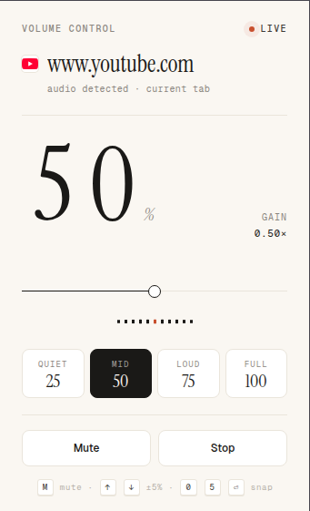

# Browser Volume Control

Browser Volume Control is a Chrome extension that lets you adjust the volume of the current tab without changing your system volume.

It is built for the common browser problem where one website is too loud, another is too quiet, and muting the entire browser is too blunt.

## Screenshot



## Features

- Control volume for the current tab.
- Mute and unmute the controlled tab.
- Use quick presets: Quiet, Mid, Loud, and Full.
- See whether the current tab is inactive, live, muted, or unavailable.
- Use keyboard shortcuts from the popup.
- Avoid broad host permissions at install time.

## Current Status

This project is in early development.

The current release focuses on Phase 1: simple current-tab volume control. Phase 2 will add remembered website preferences and richer preset modes.

## Installation For Development

```bash
npm install
npm run build
```

Then load the extension in Chrome:

1. Open `chrome://extensions`.
2. Enable Developer mode.
3. Click Load unpacked.
4. Select the generated `dist/` directory.

## Development

```bash
npm install
npm run dev
```

The development command watches the source files and writes extension output to `dist/`.

## Build

```bash
npm run build
```

## Package

```bash
npm run package
```

This creates `browser-volume-control.zip` for manual distribution or store submission.

## Keyboard Shortcuts

These shortcuts work while the extension popup is focused:

- `M`: mute or unmute.
- `ArrowUp`: increase volume by 5%.
- `ArrowDown`: decrease volume by 5%.
- `Shift + ArrowUp`: increase volume by 10%.
- `Shift + ArrowDown`: decrease volume by 10%.
- `0`: set volume to 0%.
- `5`: set volume to 50%.
- `Enter`: set volume to 100%.

## Roadmap

- Remember volume settings per website.
- Add preset modes such as Normal, Quiet, Boost, and Mute.
- Let users reset saved website preferences.
- Add a clearer onboarding flow for first-time users.
- Prepare Chrome Web Store listing assets.

See [PRODUCT_BRIEF.md](./PRODUCT_BRIEF.md) for product direction and [LLD.md](./LLD.md) for implementation notes.

## Privacy

Browser Volume Control is designed to be local-first.

- No analytics.
- No telemetry.
- No account required.
- No sale or sharing of user data.
- Phase 1 does not persist website volume preferences.

The extension uses browser extension permissions only to control the tab the user interacts with.

## Security Notes

- The extension uses Manifest V3.
- It avoids broad host permissions at install time.
- It does not execute remote JavaScript.
- It should not receive or trust control messages from web pages.
- Extension signing keys, environment files, and packaged builds should not be committed.

The current popup styling imports web fonts. For a stricter fully-offline build, bundle fonts locally and remove the external font import.

## Contributing

Contributions are welcome. Please read [CONTRIBUTING.md](./CONTRIBUTING.md) before opening a pull request.

Good first contributions include:

- Improving documentation.
- Testing the extension on common media websites.
- Reporting websites where volume control behaves unexpectedly.
- Improving accessibility of the popup controls.

## Reporting Security Issues

Please do not open public issues for security vulnerabilities. Follow [SECURITY.md](./SECURITY.md).

## License

Licensed under the [MIT License](./LICENSE).
